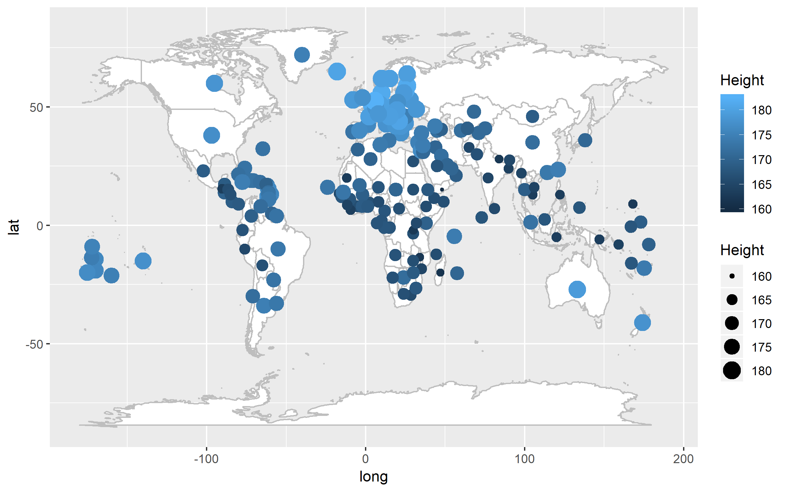
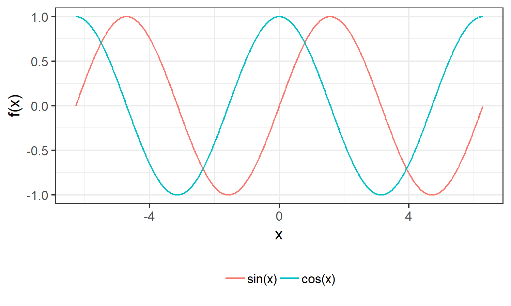
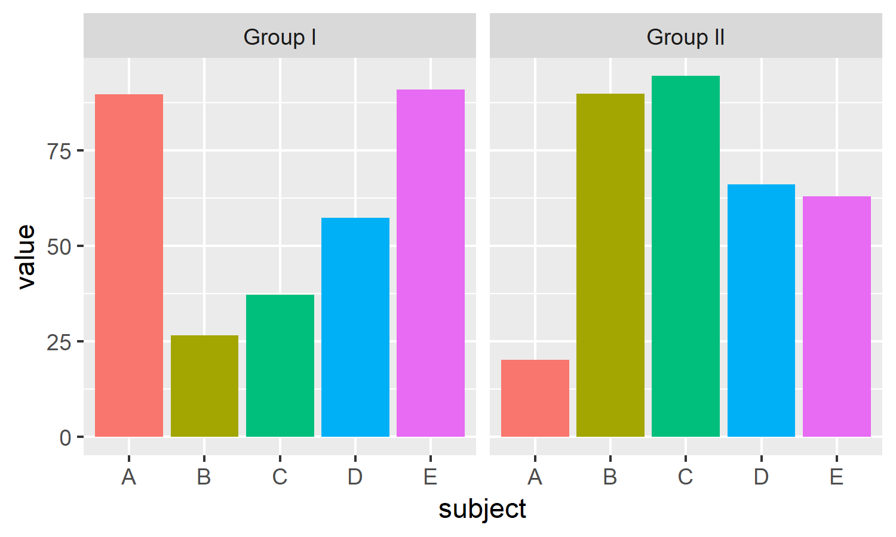

<div style="text-align:center">
  
</div>


# Scatterplot and line plot

A (2-dimensional) *scatterplot* can be used to represent the relationship between two variables by plotting pairs of observations. This can be two different variables, one variable as a function of the other, one variable as a function of time, etc. If we use a connecting line instead of just the points, we get a *line plot*.

In this example, we'll visualize the average recorded male and female height at 18 years of age by year of birth in Slovenia and Sweden First, we'll select these countries from the original data set and prepare data in long format:

```{r, warning = FALSE}
library(ggplot2)
library(tidyr)

# we obtained this data set from https://ourworldindata.org/human-height
dat <- read.csv(file = "./data/average-height-by-year-of-birth.csv")
dat <- dat[dat$Entity == "Slovenia" | dat$Entity == "Sweden",]
dat <- dat[,c(1,3,4,5)]         
names(dat) <- c("Country", "Year", "Male", "Female")
dat <- gather(dat, "Gender", "Height", -Country, -Year)

# print a few randomly selected rows
set.seed(0)
print(dat[sample(1:nrow(dat), 10),])

```

Now we can plot the data:

```{r}
tmp <- dat[dat$Gender == "Male" & dat$Year >= 1970,]

# creating a layer
ggplot() + layer(data = tmp, geom = "point", mapping = aes(x = Year, y = Height, colour = Country), stat = "identity", position = "identity") +
  ggtitle("Height of males at 18 years old by year of birth.") + 
  ylab("height (cm)") + 
  xlab("year of birth")

# using "shorthand" instructions
ggplot(tmp, aes(x = Year, y = Height, colour = Country)) +
  geom_point() + 
  ggtitle("Height of males at 18 years old by year of birth.") + 
  ylab("height (cm)") + 
  xlab("year of birth")

```

One of the advantages of ggplot2 (grammar of graphics) is that once a mapping has been determined between the data and aesthetics, we can easily add another graphical layer that uses a different geometric representation, for example, a line:

```{r}
tmp <- dat[dat$Gender == "Male" & dat$Year >= 1970,]
ggplot(tmp, aes(x = Year, y = Height, colour = Country)) +
  geom_point() + 
  ggtitle("Height of males at 18 years old by year of birth.") + 
  ylab("height (cm)") + 
  xlab("year of birth") + 
  geom_line()

```

## Shape aesthetic

```{r}
tmp <- dat[dat$Year >= 1970,]
ggplot(tmp, aes(x = Year, y = Height, colour = Country, shape = Gender)) +
  geom_point() + 
  ggtitle("Height at 18 years old by year of birth.") + 
  ylab("height (cm)") + 
  xlab("year of birth") + 
  geom_line()
```

## Facetting

```{r}
tmp <- dat[dat$Year >= 1970,]
ggplot(tmp, aes(x = Year, y = Height, colour = Country)) +
  geom_point() + 
  ggtitle("Height at 18 years old by year of birth.") + 
  ylab("height (cm)") + 
  xlab("year of birth") + 
  geom_line() + 
  facet_wrap(.~Gender)
```

By default all facets have the same scales. We can change that to each facet having its own x-scale, y-scale, or both:

```{r}
tmp <- dat[dat$Year >= 1970,]
ggplot(tmp, aes(x = Year, y = Height, colour = Country)) +
  geom_point() + 
  ggtitle("Height at 18 years old by year of birth.") + 
  ylab("height (cm)") + 
  xlab("year of birth") + 
  geom_line() + 
  facet_wrap(.~Gender, scales = "free_y")
```

We can facet on an arbitrary number of variables:

```{r}
tmp <- dat[dat$Year >= 1970,]
ggplot(tmp, aes(x = Year, y = Height)) +
  geom_point() + 
  ggtitle("Height at 18 years old by year of birth.") + 
  ylab("height (cm)") + 
  xlab("year of birth") + 
  geom_line() + 
  facet_wrap(.~Gender + Country, scales = "free_y")
```

# Histogram and density plot

A *histogram* is a way of representing the shape of the distribution of a single variable by binning the observations and plotting the counts. A *density plot* can be considered a continuous analogue to the histogram -- instead of binning the observations, we use some sort of kernel density observation.

For this example, we'll use data from all countries but only for year 1996:
```{r}
# we obtained this data set from https://ourworldindata.org/human-height
dat <- read.csv(file = "./data/average-height-by-year-of-birth.csv")
dat <- dat[dat$Year == 1996,]
dat <- dat[,c(1,3,4,5)]         
names(dat) <- c("Country", "Year", "Male", "Female")
dat <- gather(dat, "Gender", "Height", -Country, -Year)
```

Our goal is to understand the distribution of male/female heights across the world:
```{r}
ggplot(dat, aes(x = Height)) + 
  geom_density() + 
  xlim(140,190)
ggplot(dat, aes(x = Height, fill = Gender)) + 
  geom_density(alpha = 0.5) + 
  xlim(140,190)

# NOTE: it's easy to save plots in one of the common formats 
# (jpg, png, bmp, eps, pdf; it automatically reads the extension)
g1 <- ggplot(dat, aes(x = Height, fill = Gender)) + 
  geom_density(alpha = 0.5) + xlim(140,190)
ggsave("my_plot.pdf", g1, width = 5, height = 3)
```

```{r}
ggplot(dat, aes(x = Height)) + 
  geom_histogram()
ggplot(dat, aes(x = Height)) + 
  geom_histogram() + 
  facet_wrap(.~Gender)
```

# Bar plot

A *bar plot* can be used to represent the value of a variable for different groups. This includes representing the distribution of a variable with a relatively small number of unique values (categorical, ordinal) or the relationship between such a variable and a property of a numerical variable (for example, the mean).

In this example we'll plot the average age for different parts of the world:

```{r}
# we obtained this data set from https://ourworldindata.org/human-height
dat <- read.csv(file = "./data/average-height-by-year-of-birth.csv")
dat <- dat[dat$Year == 1996,]
dat <- dat[,c(1,3,4,5)]         
names(dat) <- c("Country", "Year", "Male", "Female")
dat <- gather(dat, "Gender", "Height", -Country, -Year)
dat <- dat[dat$Country %in% c("Middle East and North Africa", "South Asia", "Sub-Saharan Africa", "Latin America and Caribbean",
                              "Europe and Central Asia","East Asia and Pacific"),]

ggplot(dat, aes(x = Country, y = Height, fill = Gender)) +
  geom_bar(stat = "identity", position = "dodge")
ggplot(dat, aes(x = Country, y = Height, fill = Gender)) + 
  geom_bar(stat = "identity", position = "dodge") + 
  coord_flip()


```


# Boxplot

```{r}
# we obtained this data set from https://ourworldindata.org/human-height
dat <- read.csv(file = "./data/average-height-by-year-of-birth.csv")
dat <- dat[,c(1,3,4)]         
names(dat) <- c("Country", "Year", "Height")
dat <- dat[dat$Year > 1960,]

ggplot(dat, aes(x = factor(Year), y = Height)) + 
  geom_boxplot()
ggplot(dat, aes(x = factor(Year), y = Height)) + 
  geom_boxplot() +
  xlab("Year") + 
  theme(axis.text.x = element_text(angle = 90, vjust = 0.5))


```


# Practice examples

## Example 1



```{r}
# create data set
dat <- read.csv(file = "./data/average-height-by-year-of-birth.csv")
dat <- dat[,c(1,3,4)]         
names(dat) <- c("Country", "Year", "Height")
dat <- dat[dat$Year == max(dat$Year),]
geo <- read.csv("./data/countries.csv")[,-1]
df <- merge(dat, geo)


# create plot
world_map <- readRDS("./data/world_map.rds") # preloaded from maps package
ggplot() +
  geom_polygon(world_map, mapping = aes(x = long, y = lat, group=group), fill="white", colour="gray")

```

## Example 2



```{r}
# create data set
x <- seq(-2*pi, +2*pi, 0.01)
df <- data.frame(x = x, y = sin(x), fun = "sin(x)")
df <- rbind(df, data.frame(x = x, y = cos(x), fun = "cos(x)"))

# create plot
```


## Example 3



```{r}
# create data set
set.seed(0)
x <- c("A", "B", "C", "D", "E")
y <- runif(10, 0, 100)
df <- data.frame(subject = rep(x, 2), value = y, type = rep(c("Group I", "Group II"), each = 5))

# create plot
```

