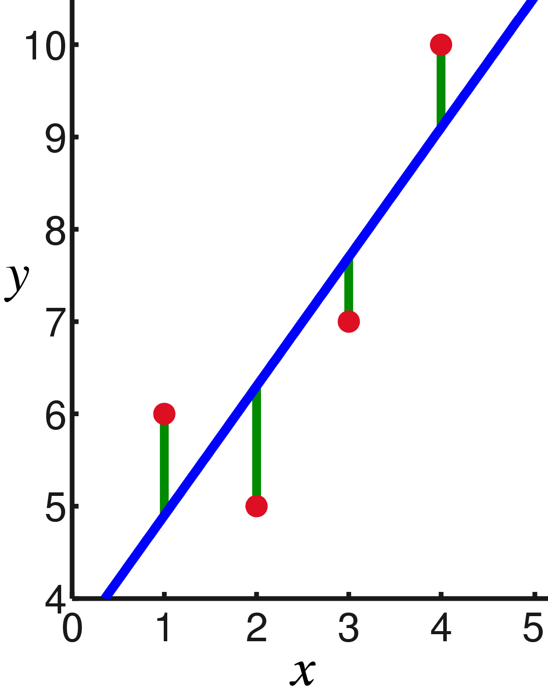

<div style="text-align:center">
  
</div>


# Basic data analysis

## Descriptive (summary) statistics

Descriptive statistics are numerical summarizations of a particular data set, which can be either a representation of the entire or a sample of a population. Descriptive statistics can be broken down into measures of central tendency and measures of variability (spread).

Mean, also called mathematical expectation or average, is probably the most basic descriptive statistic, calculated as the sum of all values divided by the number of values. To calculate mean in R we can use the `mean()` function.

```{r}
# load data
data <- read.csv("./data/temperature.csv", sep=";")

# mean temperature
mean(data$temperature)
```

The trimmed mean (also truncated mean) involves the calculation of the mean after discarding given parts of a sample at the high and low end. So for example the 5% trimmed mean would first discard the 5% of the lowest and the 5% of the highest values and then calculate mean of the remaining values.


```{r}
# 5% trimmed mean
mean(data$temperature, trim=0.05)
```

Median represents the value that separates the higher half of the data sample from the lower half of the data sample (50% of values in the sample are lower than the median and 50% of values in the sample are higher than the median).

```{r}
# some data
some_data <- c(1, 2, 2, 4, 5, 7, 7, 9, 10)
median(some_data)
```

The standard deviation is a measure that is used to quantify the amount of variation or dispersion of a set of data values. A low standard deviation indicates that the data points tend to be close to the mean of the set, while a high standard deviation indicates that the data points are spread out over a wider range of values. If data are normally distributed then we can use the _68–95–99.7 rule_ to quickly assess the spread of the data -- approximately 68% of the data lies in a band of $\pm SD$ from the mean, 95% lies in a band of $\pm 2SD$ from the mean and 99.7% of the data lies in a band of $\pm 3SD$ from the mean. To calculate the standard deviation in R we can use the `sd()` function.

```{r}
# standard deviation
sd(data$temperature)
```

Confidence interval (CI) represents a range of values for which we are fairly sure the true value of a certain population parameter lies in. When calculating the interval we can specify the desired degree of confidence. The example below calculates the 95% CI for the temperature. We can calculate the interval's lower and upper bounds by using the `quantile()` function. In the example below we merge the two bounds in a proper mathematical representation of an interval by using the `paste0()` function.

```{r}
# lower bound - discard bottom 2.5% of the data
lower <- quantile(data$temperature, 0.025)

# upper bound - discard top 2.5% od the data
upper <- quantile(data$temperature, 1 - 0.025)

# merge
paste0("[", lower, ", ", upper, "]")
```

We can use all of the functions above inside the `dplyr` framework, for example we can easily calculate mean temperature for each country independently.

```{r, message = FALSE}
# load the library
library(dplyr)

# calculate
countries_t <- data %>%
  group_by(country) %>%
  summarize(mean_t = mean(temperature))

countries_t
```

## Linear regression model

The linear regression model (sometimes also called just the linear model) is a linear approach towards modelling the relationship between the dependent (or response) variable and one or more independent (or explanatory) variables. In this workshop we will take a look at the simplest case with only one explanatory variable, which is called simple linear regression.

The dependent ($y$) and the independent variable ($x$) are thus linked via the $y = kx + n$ equation, where $n$ represents the value of the intercept and $k$ the slope. Intercept defines the value of the dependent variable when the independent variable equals 0. The slope determines the correlation between the two variables, if slope is positive, $x$ and $y$ are positively correlated (larger $x$ results in a larger $y$) and if slope is negative they are negatively correlated (larger $x$ results in a smaller $y$). Usually the regression line is calculated in way that minimizes squared values of errors. On the image below data points are marked as red circles, errors as green lines and the blue line represents the calculated regression line.

<div style="text-align:center">
  
</div>

In R we can use the `lm()` function to calculate the linear regression model. The example below calculates how temperature in Slovenia is correlated with the first 6 months (January to June).

```{r, message = FALSE}
# filter the data
t_6 <- data %>%
  filter (country == "Slovenia" & month <= 6)

# set January as month 0
t_6$month_minusone <- t_6$month - 1

result <- lm(formula = temperature ~ month_minusone, data = t_6)
result
```

The output states that the average temperature at month 0 (January) is -2.54 °C and the temperature grows by 3.72 °C each month from January to June. We can also visualize this by using some basic R programming and `ggplot`.

```{r, message = FALSE}
# load ggplot library
library(ggplot2)

# intercept is stored in
intercept <- result$coefficients[1]

# slope is stored in 
slope <- result$coefficients[2]

# x - months
x <- 1:8

# y - temperature
y <- slope * (x - 1) + intercept

# create data frame
reg_line <- data.frame(x=x, y=y)

# plot
ggplot() +
  geom_point(data=t_6, aes(x=month, y=temperature), alpha=0.1, shape=16) +
  geom_line(data=reg_line, aes(x=x, y=y), size=1)
```


